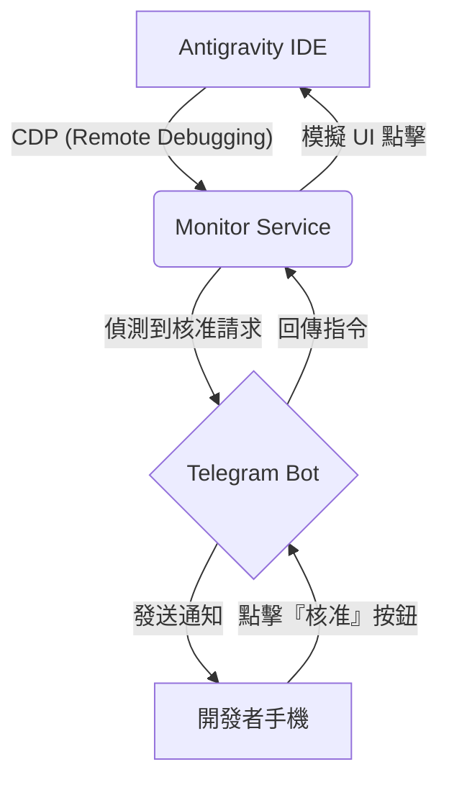

# Antigravity Notify 🚀

一款針對 Antigravity AI IDE 設計的遠端監控與核准通知工具。

## 📌 項目簡介

Antigravity AI IDE 在執行過程中經常需要使用者手動核准（如代碼寫入、終端執行等）。本工具透過監控 IDE 狀態，在需要核准時第一時間透過 **Telegram** 發送通知，並支援遠端直接回覆核准，讓開發者無需時刻盯著 IDE 畫面。

---

## 🏗️ 採用架構：Chrome DevTools Protocol (CDP)

基於 [RESEARCH.md](RESEARCH.md) 的調查結果，本專案捨棄了不穩定的日誌監控與會被封堵的 Extension 攔截方案，採用最底層且穩定的 **Chrome DevTools Protocol (CDP)** 方案。

### 核心原理
Antigravity 基於 Electron 開發，本工具透過開啟其內建的遠端偵錯端口（Remote Debugging Port），直接讀取渲染層的 DOM 樹來偵測 UI 變化，並模擬點擊操作。

### 系統流程圖


### 為什麼選擇 Node.js？
1. **CDP 原生支援**：Node.js 擁有最強大的瀏覽器自動化生態庫（如 `puppeteer-core`），與基於 Electron 的 Antigravity 互動最為契合。
2. **高效異步處理**：Node.js 的事件循環機制非常適合處理持續監控（Polling）與分散式的 Telegram Bot 通訊。
3. **生態鏈成熟**：`Telegraf` 等 SDK 提供了豐富的 Telegram 互動控制（如 Inline Buttons），能快速實現遠端核准邏輯。
4. **驗證成功方案**：參考開源專案已證實 Node.js 能夠繞過 IDE 限制進行內容監控。

---

## ✨ 核心功能

- **即時監控**：透過 CDP 毫秒級偵測 IDE 介面變化。
- **智能過濾**：自動辨識代碼審查、終端執行等不同類型的核准請求。
- **Telegram 互動**：
  - 帶有 Inline 按鈕的即時通知。
  - 直接在 Telegram 點擊 `✅ Approve` 或 `❌ Deny`。
- **遠端操作**：無需切換視窗，透過手機即可完成 IDE 內的核准流程。

---

## 🛠️ 技術棧

- **Runtime**: Node.js
- **Protocol**: Chrome DevTools Protocol (CDP)
- **Library**: `puppeteer-core` (用於 CDP 通訊)
- **Notification**: `Telegraf` (Telegram Bot API)

---

## 🚀 快速開始

### 1. 以偵錯模式啟動 Antigravity
本工具依賴 CDP，啟動 IDE 時必須帶上端口參數：
```bash
antigravity . --remote-debugging-port=9222
```

### 2. 配置環境變數
建立 `.env` 檔案並設定 Telegram Bot Token：
```env
TELEGRAM_BOT_TOKEN=your_token_here
TELEGRAM_CHAT_ID=your_chat_id
REMOTE_PORT=9222
```

### 3. 啟動監控服務
```bash
npm install
npm start
```

---

## 📄 相關文件

- [PRD (產品需求文件)](PRD.md)
- [RESEARCH (技術調查報告)](RESEARCH.md)
- [CHANGELOG](CHANGELOG.md)
